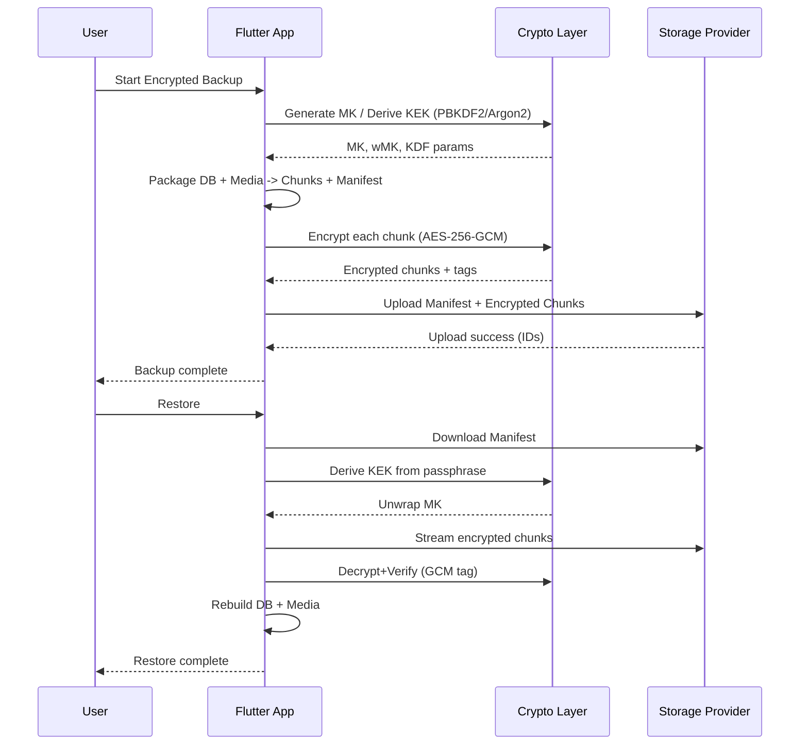

# خطة تنفيذ Backup/Restore مشفّر بالكامل (E2EE) في Flutter يقودها AI Agent — مستوى مؤسسي

> الهدف: بناء نظام نسخ احتياطي/استعادة مشفّر طرف-لطرف لبيانات التطبيق (مثل WhatsApp) بآلية موثوقة، قابلة للتوسّع، وقابلة للتدقيق. هذه الخطة مكتوبة لتُنفّذ بواسطة AI Agent خطوة بخطوة بدون أخطاء، مع معايير قبول واختبارات وتفاصيل تنفيذ دقيقة.

---

## 0) نظرة عامة مع معمارية الحل

- **Client (Flutter App)**
  - طبقة **Crypto**: توليد المفاتيح، KDF، تشفير/فك تشفير (AES-256-GCM)، حساب SHA-256.
  - طبقة **Packager**: استخراج البيانات (SQLite + Media + Settings)، ضغط (اختياري Zstd/GZip)، تقسيم لChunks، إنشاء Manifest.
  - طبقة **Storage Providers**: Firebase Storage (افتراضي)، Google Drive (اختياري)، iCloud Drive (اختياري iOS).
  - طبقة **Jobs**: جدولة عمليات Backup/Restore (WorkManager/BackgroundFetch)، الإيقاف والاستكمال، مراقبة الطاقة والشبكة.
  - طبقة **UX**: تدفّق تفعيل الحماية بكلمة مرور، توليد Recovery Key، شاشة تقدم ونِسب، سجلّ عمليات.

- **Cloud (Zero-Knowledge)**
  - يخزّن **ملف Manifest** + **Chunks مشفّرة** فقط.
  - لا يخزّن أي مفاتيح غير ملفوفة/مكشوفة.

- **Security**
  - **MK (Master Key)** يولَّد محلّيًا.
  - **KEK (Key Encryption Key)** يُشتق من Passphrase عبر PBKDF2/Argon2.
  - نخزّن wMK (المفتاح الرئيسي ملفوفًا) فقط داخل Manifest.
  - لا نرفع أي شيء يمكنه فك البيانات بدون الـ Passphrase/الـ Secure Enclave.



---

## 1) المتطلبات (Dependencies) — يثبّت تلقائيًا بواسطة الـ Agent

- **Crypto**: `package:cryptography` (يدعم AES-GCM, PBKDF2, HMAC, SHA-256)
- **Secure Storage**: `flutter_secure_storage` (Android Keystore / iOS Keychain)
- **File I/O**: `path_provider`, `dart:io`, `archive` (أو `zstd` إن توفر)
- **Cloud** (اختر واحدًا أو أكثر):
  - افتراضي: `firebase_core`, `firebase_storage`, `firebase_auth`
  - بديل: Google Drive API (`googleapis`, OAuth via `google_sign_in`)
  - iOS: iCloud Drive (plugin مناسب أو Channel مخصّص)
- **Background**: `workmanager` (Android), `background_fetch`
- **Connectivity**: `connectivity_plus`
- **Pickers/Permissions** (اختياري): `file_picker`, `permission_handler`
- **State Mgmt**: Provider/Riverpod (حسب مشروعك)
- **Logging**: `logger` + Export إلى Crashlytics/Sentry (بدون أسرار)

> **معيار قبول**: جميع الحزم تُضاف، تبني بدون أخطاء، تُنشأ ملفات إعدادات Firebase وتعمل على Android/iOS.

---

## 2) نمذجة المفاتيح وكفى (Key Management Spec)

- **MK (Master Key)**: 32 بايت عشوائي (AES-256). يُولَّد بواسطة CSPRNG.
- **Passphrase**: يحدده المستخدم (اختياري لكن موصى به). طول ≥ 10 أحرف + تنبيه قوة.
- **KDF**:
  - **افتراضي**: PBKDF2-HMAC-SHA256، `iterations = 210000`، `salt = 16 bytes random`.
  - **بديل قوي**: Argon2id (إن اعتمدت إضافة موثوقة).
- **KEK**: مفتاح اشتقاقي بطول 32 بايت من الـ Passphrase.
- **Wrapping**:
  - wMK = **AES-256-GCM**(key = KEK, plaintext = MK, iv = random 12B, aad = header).
  - نخزّن الــ iv, tag, salt, iterations داخل الـ Manifest.
- **Device-bound mode (اختياري)**:
  - نخزّن MK داخل `SecureStorage` مغلَّفًا بمفتاح HW-backed (Biometrics Optional).
  - في هذه الحالة لا نرفع wMK (أو نضعه مغلفًا بمفتاح Recovery Key).
- **Recovery Key** (اختياري بشدة):
  - 32 رمز Base32/Hex تُولّد محليًا وتُعرض للمستخدم للطباعة/الحفظ.
  - تُستخدم لتغليف MK كنسخة أمان ثانية: `wMK_rk = Enc_GCM(KEK_rk, MK)`.

> **معايير قبول أمنية**:
> - لا يتم إرسال MK أو KEK خارج الجهاز.
> - لا تُسجَّل المفاتيح أو الـ passphrase في أي Log.
> - مسح الذاكرة الحساسة قدر الإمكان (Best-effort) بعد الاستخدام.

---

## 3) بنية بيانات النسخة الاحتياطية (Backup Package)

- **Manifest** (JSON مشفّر جزئيًا/علنيًا جزئيًا):
```json
{
  "schema": "alkhazna.e2ee.backup",
  "version": 1,
  "createdAt": "2025-09-04T00:00:00Z",
  "appVersion": "X.Y.Z",
  "platform": "android|ios",
  "userId": "<uid>",
  "kdf": {"algo":"PBKDF2-HMAC-SHA256","salt":"<b64>","iterations":210000},
  "enc": {"algo":"AES-256-GCM"},
  "wmk": {"iv":"<b64>","tag":"<b64>","ct":"<b64>"},
  "compression": "zstd|gzip|none",
  "chunkSize": 8388608,
  "files": [
    {"id":"db","type":"sqlite","path":"/data.db","chunks":[{"seq":0,"name":"db.part0","sha256":"<hex>","size":12345,"iv":"<b64>","tag":"<b64>"}],"totalSize":12345},
    {"id":"media","type":"dir","path":"/media","chunks":[{"seq":0,"name":"media.part0", "sha256":"<hex>","size":...}],"totalSize":...}
  ],
  "uploadIds": {"provider":"firebase","sessionId":"<uuid>"}
}
```

- **Chunks**: كل جزء يُشفّر مستقلًا بـ AES-GCM (IV 12B، Tag 16B).
- **Integrity**: SHA-256 لكل Chunk مخزّن في Manifest للتحقق بعد التحميل/التنزيل.

> **معيار قبول**: عند تغيير صيغة Manifest، يزداد حقل `version` وتتوفّر ترقية متوافقة.

---

## 4) تدفّق النسخ الاحتياطي (Backup Flow) — خطوات تنفيذية للـ Agent

1. **Preflight**
   - تحقق من: شحن ≥ 30%، اتصال Wi‑Fi (أو موافقة على البيانات)، مساحة فارغة محلية ≥ 2× حجم DB، مساحة سحابية كافية.
   - اقفل قاعدة البيانات بوضع Read-Only Snapshot أثناء التعبئة.

2. **توليد/استرجاع المفاتيح**
   - إن لم يوجد MK: ولّد MK 32B وخزّنه مؤقتًا بالذاكرة فقط.
   - إن كان وضع الـ passphrase مفعّل: اشتق KEK ← لفّ MK → wMK.
   - إن كان وضع device-bound: خزّن MK في SecureStorage (خيار حماية ببصمة).

3. **التعبئة (Packaging)**
   - استخراج DB (نسخة snapshot) + مسارات الميديا.
   - ضغط (zstd/gzip) إن تمكين الأداء/المساحة.
   - تقسيم لChunks (افتراضي 8MB لكل Chunk).

4. **التشفير**
   - لكل Chunk: IV عشوائي 12B، Encrypt AES-256-GCM (key = MK، aad = `fileId|seq|schemaVersion`).
   - احسب SHA-256 للـ Ciphertext وخزّنه في Manifest.

5. **الرفع السحابي**
   - افتح جلسة رفع (Firebase Storage resumable upload).
   - ارفع Manifest (بدون wMK إن كان device-bound-only)، ثم ارفع Chunks (توازي محدود: 3–5).
   - سجّل `uploadIds` ومواضع الاستكمال.

6. **التحقق والختام**
   - بعد الرفع، قم بتنزيل عيّنة (أو HEAD/MD5 إن متاح) للتحقق.
   - اكتب سجلّ عملية في Local Log (بدون أسرار): وقت، حجم، عدد الملفات، provider.

> **معايير قبول تشغيلية**: الاستئناف يعمل عند انقطاع الاتصال، وإلغاء العملية لا يترك حالات مشوّهة.

---

## 5) تدفّق الاستعادة (Restore Flow)

1. **Preflight**
   - تحقق من السعة المحلية، الاتصال، نسخة التطبيق ≥ الحد الأدنى المطلوب للـ schema.

2. **جلب Manifest**
   - حمّل Manifest، تحقّق من `schema/version`.

3. **فك تغليف MK**
   - إن كان wMK موجودًا: اطلب Passphrase، اشتق KEK، فكّ wMK ← MK.
   - إن كان Device-bound: اجلب MK من SecureStorage/biometric.
   - إن كان Recovery Key موجود: خيار بديل لفك wMK_rk.

4. **تنزيل وفك التشفير**
   - نزّل الChunks بتوازي محدود.
   - لكل Chunk: تحقّق SHA-256، ثم فك تشفير AES-GCM (aad مطابق)، ثم فك الضغط، ثم إعادة التجميع للملف الأصلي.

5. **إعادة البناء**
   - استبدال DB الحالية بنسخة مستعادة (مع إغلاق آمن للتطبيق/الخدمة).
   - إعادة وضع الميديا في مجلداتها، وصيانة الروابط (IDs) داخل DB.

6. **التحقق**
   - افتح DB بالقراءة، تحقق من جداول/عدادات أساسية.
   - اختبارات سمات: وجود N من السجلات، وجود ملفات ميديا المشار إليها.

> **معايير قبول**: لو فشل Chunk واحد → تعرض رسالة دقيقة، مع إمكانية إعادة محاولة Chunkات فاشلة فقط.

---

## 6) تصميم الواجهات (UX) بإيجاز

- شاشة **Enable Encrypted Backup**:
  - اختيار: Device-bound / Passphrase / +Recovery Key.
  - قياس قوة كلمة المرور وعرض تحذيرات.
- شاشة **Create Recovery Key**: توليد، عرض، إلزام المستخدم بتأكيد أنه خزّنها.
- شاشة **Backup Now / Schedule**: تنفيذ يدوي، جدولة يومية/أسبوعية، شروط (Wi‑Fi/شحن).
- شاشة **Restore**: اختيار نسخة، إدخال Passphrase/استخدام Biometrics، شريط تقدم، تفاصيل الأخطاء.
- شاشة **Backup Health**: آخر نجاح، الحجم، مزوّد التخزين.

---

## 7) طبقات الكود وهيكلة المشاريع

```
lib/
  services/
    crypto/
      key_manager.dart
      crypto_service.dart
    backup/
      packager.dart
      manifest.dart
      backup_service.dart
      restore_service.dart
    storage/
      storage_provider.dart
      firebase_storage_provider.dart
      gdrive_storage_provider.dart
      icloud_storage_provider.dart
  workers/
    backup_job.dart
    restore_job.dart
  ui/
    screens/backup_enable_screen.dart
    screens/backup_status_screen.dart
    screens/restore_screen.dart
  utils/
    logging.dart
    bytes.dart
```

### واجهات أساسية (Dart APIs)

```dart
abstract class StorageProvider {
  Future<String> uploadChunk(String remotePath, Stream<List<int>> data, int length, {String? contentType});
  Future<Stream<List<int>>> downloadChunk(String remotePath);
  Future<void> putJson(String remotePath, Map<String, dynamic> json);
  Future<Map<String, dynamic>> getJson(String remotePath);
  Future<bool> exists(String remotePath);
}

class CryptoService {
  Future<Uint8List> generateRandom(int length);
  Future<KdfResult> deriveKek(String passphrase, Uint8List salt, int iterations);
  Future<WrapResult> wrapKey(Uint8List kek, Uint8List mk);
  Future<Uint8List> unwrapKey(Uint8List kek, WrapResult wrapped);
  Future<EncChunk> encryptChunk(Uint8List mk, Uint8List plaintext, {Uint8List? aad});
  Future<Uint8List> decryptChunk(Uint8List mk, EncChunk enc, {Uint8List? aad});
}
```

> **معيار قبول**: جميع الواجهات مُغطّاة باختبارات وحدات بنسبة ≥ 90%.

---

## 8) ضوابط الأداء والموثوقية

- **Chunk Size**: 8–16MB (اختبار A/B حسب الأجهزة).
- **Parallelism**: 3–5 عمليات رفع/تنزيل موازية.
- **Compression**: Zstd إن متاح (أفضل سرعة/نسبة)، وإلا Gzip.
- **Streaming/Isolates**: استخدام `Isolate` لتشفير/ضغط بدون تجميد الـ UI.
- **استئناف**: تخزين حالة الرفع محليًا (آخر Chunk مرفوع/منزّل).

> **SLOs**: فشل ≤ 1% لكل 100 عملية، زمن بدء < 3 ثوانٍ، UI لا يتجمّد > 100ms.

---

## 9) الأمان والامتثال (Threat Model مختصر)

- **تهديدات**: فقدان Passphrase، سرقة الجهاز، مزوّد سحابي فضولي، تعديل بيانات أثناء النقل.
- **التخفيف**: E2EE، Integrity via GCM + SHA-256، عدم رفع مفاتيح، خيار Recovery Key، مصادقة قوية للحساب.
- **Logs**: خالية من الأسرار، حظر نسخ القيم الحساسة، Redaction للـ PII.
- **CSP**: سياسات داخلية لتحديث KDF params دوريًا (رفع iterations مع الإصدارات).

---

## 10) اختبارات شاملة (QA Matrix)

- **وحدات**: Crypto (wrap/unwrap، encrypt/decrypt، KDF)، Manifest parser، Storage mocks.
- **تكامل**: Backup→Upload→Download→Restore على بيانات عشوائية ومع حجوم حقيقية.
- **تحمّل**: ملفات حتى 10GB Media (على مراحل)، انقطاع شبكة عشوائي، بطارية منخفضة.
- **أمن**: تحقق أن فك التشفير بكلمة خاطئة يفشل دومًا، وأن أي تعديل Byte واحد يفشل.
- **E2E**: تشغيل على Android/iOS حقيقيين، مقارنة DB قبل/بعد (hashes وعدّ السجلات).

> **معيار قبول**: `decrypt(encrypt(x)) == x` لـ 1000 حالة عشوائية؛ نسبة نجاح الاستئناف ≥ 99%.

---

## 11) خطة الترحيل (Migration)

- من نسخ غير مشفّرة/قديمة → إصدار `schema=1`:
  - أول Backup بعد التحديث: يحوّل تلقائيًا.
  - احتفظ بآخر نسختين للعودة (Retention=2) مع وسم الإصدار.

---

## 12) مراقبة وتشغيل (Observability)

- **Metrics**: زمن التشفير/فك التشفير، سرعة الرفع/التحميل، حجم النسخة، نسبة الفشل.
- **Tracing**: معرّف جلسة لكل عملية لربط السجلات.
- **Alerts**: فشل متكرر للمستخدم نفسه، مساحة سحابية غير كافية.

---

## 13) مهام الـ AI Agent — SOP قابلة للتنفيذ

### المرحلة A — تأسيس البنية
1. تهيئة Firebase للمشروع (Android+iOS) وتثبيت الحزم المذكورة.
2. إنشاء المجلدات والملفات وفق الهيكل أعلاه.
3. تنفيذ `StorageProvider` لـ Firebase أولًا (putJson/upload/download).
4. إنشاء `CryptoService` باستخدام `package:cryptography`.
5. إنشاء نماذج `Manifest`, `EncChunk`, `WrapResult`, `KdfResult`.

**Checkpoints**:
- بناء ناجح، اختبارات وحدات أولية لـ CryptoService (≥80%).

### المرحلة B — التعبئة والتشفير
1. تنفيذ `packager.dart`: أخذ Snapshot للـ DB وEnumerate للـ media.
2. إضافة ضغط (قابل للتعطيل)، وتقسيم لChunks.
3. تشفير Chunk-By-Chunk مع AAD ثابت النمط.
4. إنشاء Manifest وملؤه بـ hashes وMeta.

**Checkpoints**:
- اختبار حزمة صغيرة (DB فقط)؛ حجم/زمن مقبول؛ Integrity صحيح.

### المرحلة C — الرفع والاستئناف
1. رفع Manifest مؤقّت (draft)، ثم رفع Chunks مع سجّل حالة محلي.
2. عند النجاح الكامل، ترقية Manifest إلى نهائي (atomic flag).
3. دعم الاستئناف عند الفشل (من آخر `seq`).

**Checkpoints**:
- قطع Wi‑Fi أثناء الرفع → استئناف تلقائي يعمل.

### المرحلة D — الاستعادة
1. تنزيل Manifest، فك wMK (أو جلب MK من SecureStorage/Recovery Key).
2. تنزيل/فك تشفير/فك ضغط Chunks وإعادة بناء الملفات.
3. استبدال DB ووسائطها بأمان.

**Checkpoints**:
- مقارنة hash DB قبل/بعد في بيئة اختبار.

### المرحلة E — UX والتجربة
1. شاشات الإعداد والتمكين وRecovery Key.
2. شاشات التقدّم وسجل العمليات.
3. رسائل أخطاء محلية واضحة (بالعربية والإنجليزية).

**Checkpoints**:
- اختبارات Widget أساسية لسيناريوهات النجاح/الفشل.

---

## 14) معايير القبول النهائية (Acceptance Criteria)

- النسخ الاحتياطي والاستعادة يعملان على Android 8+ و iOS 13+.
- لا يمكن لأي طرف ثالث (أو سيرفر) قراءة المحتوى بدون Passphrase/Device Secret.
- Integrity صارمة: أي تعديل يُكتشف ويمنع الاستعادة الجزئية الصامتة.
- الاستئناف موثوق، وسجلّ عمليات واضح، وتجربة مستخدم غير محبِطة.

---

## 15) ملاحظات تنفيذ دقيقة وحِيل عملية

- استخدم `Random.secure()` أو مولّد CSPRNG في `cryptography`.
- لا تعِد استخدام IV ذاته لــ AES-GCM أبدًا؛ لكل Chunk IV جديد.
- أدرج `schemaVersion|fileId|seq` داخل AAD لتثبيت السياق.
- أغلق DB أثناء Snapshot لتجنّب عدم الاتساق.
- عند الاستعادة، نفّذ إعادة البناء في مجلد Temp ثم استبدالًا Atomically.
- استخدم Isolates للضغط/التشفير لتفادي تجميد UI.
- اختبر على ملفات > 2GB، وتأكّد من حدود الذاكرة (streaming بدلاً من التحميل الكامل في الذاكرة).

---

## 16) أمثلة تهيئة (Snippets مختصرة)

```dart
// PBKDF2 derive
final algo = Pbkdf2(macAlgorithm: Hmac.sha256(), iterations: 210000, bits: 256);
final secretKey = await algo.deriveKey(
  secretKey: SecretKey(utf8.encode(passphrase)),
  nonce: saltBytes,
);
final kek = await secretKey.extractBytes();

// AES-GCM encrypt chunk
final aes = AesGcm.with256bits();
final secret = SecretKey(mkBytes);
final nonce = await rng(12);
final secretBox = await aes.encrypt(
  chunkPlaintext,
  secretKey: secret,
  nonce: nonce,
  aad: aadBytes,
);
```

> **تذكير**: الأمثلة توضيحية — الـ Agent سيولّد كودًا كاملاً مطابقًا للواجهات والمعايير أعلاه.

---

## 17) خارطة طريق قصيرة (Timeline داخلية للـ Agent)

- **يوم 1**: المرحلة A + اختبارات Crypto.
- **يوم 2**: المرحلة B + Manifest.
- **يوم 3**: المرحلة C (رفع/استئناف).
- **يوم 4**: المرحلة D (استعادة كاملة) + اختبارات تكامل.
- **يوم 5**: المرحلة E (UX) + صقل الأداء + وثائق المستخدم.

> *الزمن تقريبي داخلي، يمكن ضغطه/تمديده حسب حجم الميديا.*

---

## 18) ماذا بعد؟ (تحسينات اختيارية)

- **Key Rotation**: إنشاء MK جديد مع ترحيل تدريجي.
- **Delta Backups**: حفظ تغييرات فقط بالنسبة لآخر نسخة (inode/time+hash).
- **Multi-Provider**: نسخ لناديْن سحابيين بالتوازي لزيادة الموثوقية.
- **Secret Sharing**: تقسيم Recovery Key على 2–3 موثوقين (Shamir) — لاحقًا.

---

**هذه الخطة جاهزة للتنفيذ الآلي.** عند رغبتك، يمكنني توليد Scaffold الكود مع اختبارات أساسية وفق الواجهات المذكورة، وتوصيله بمشروعك الحالي (Al Khazna) مباشرة.

