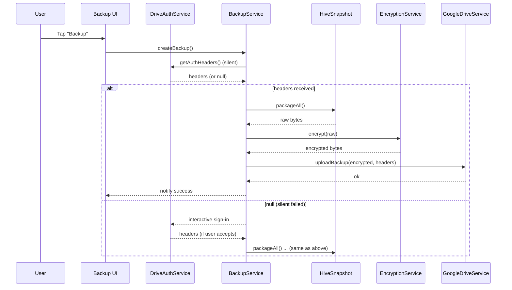

# PRD + BLUEPRINT — **Al Khazna Offline-First** مع **Silent Backup Sign-In**

**Version:** 1.0
**Platform:** Flutter (Android/iOS)
**Owner:** Mido
**Priority:** Critical
**Target:** Enable 100% offline usage + one-tap backup (silent sign-in) بدون المساس بنظام التشفير والنسخ الاحتياطي القائم.

---

## 1) Executive Summary

تحويل **Al Khazna** إلى تطبيق **Offline-First** بالكامل :

* كل المهام اليومية (Income / Outcome / Balance / PDF Export) تعمل بدون إنترنت.
* عند الضغط على **Backup** يتم **Silent Google Sign-In** تلقائيًا ثم رفع النسخة المشفّرة إلى **Drive AppData**.
* عدم تعديل أي جزء من **EncryptionService / KeyManager / Backup & Restore Architecture**.

---

## 2) Problem Statement

الإصدار الحالي يتطلب إنترنت لبعض التدفقات (تسجيل/مصادقة)، ما يضعف تجربة الاستخدام عند انقطاع الشبكة، ويجبر المستخدم على تسجيل الدخول يدويًا في كل مرّة لعمل النسخ الاحتياطي.

---

## 3) Goals & Success Metrics

| Goal                         | KPI / Target                                            |
| ---------------------------- | ------------------------------------------------------- |
| تشغيل أوفلاين بالكامل        | 100% من الشاشات تعمل بدون إنترنت                        |
| تجربة نسخ احتياطي سلسة       | Silent sign-in success ≥ 95%                            |
| الحفاظ على المعمارية الأمنية | لا تغييرات على AES-256-GCM / KeyManager                 |
| سرعة بدء النسخ الاحتياطي     | < 3 ثوانٍ من ضغط الزر حتى بدء الرفع                     |
| موثوقية البيانات             | 0 أعطال/فقدان بيانات في سيناريوهات الإغلاق وإعادة الفتح |

---

## 4) In/Out of Scope

| In Scope                                                               | Out of Scope                                       |
| ---------------------------------------------------------------------- | -------------------------------------------------- |
| طبقة بيانات محلية (Hive) كمصدر وحيد للحقيقة                            | تغيير خوارزميات التشفير                            |
| Local Auth (SecureStorage/biometric) لتخطي اعتماد الإقلاع على الإنترنت | مزامنة لحظية أو دمج متعدد الأجهزة                  |
| Silent Google Sign-In عند الضغط على Backup                             | تغيير الصلاحيات/النطاقات (scopes) الخاصة بـ Google |
| UX للأوفلاين (منع أخطاء الشبكة)                                        | إعادة تصميم شامل للواجهة                           |
| تكامل مع Backup/Restore الحالي كما هو                                  | Firebase Database/Firestore                        |

---

## 5) High-Level Architecture

```
Al Khazna (Offline-First)
├── LocalAuthService (SecureStorage / Biometric)
├── HiveDatabaseService
│   ├── incomeBox
│   ├── outcomeBox
│   └── settingsBox (prefs, flags)
├── BackupService
│   ├── DriveAuthService (silent sign-in)
│   ├── EncryptionService (AES-256-GCM)
│   ├── GoogleDriveService (AppData Folder)
│   └── RestoreService
├── PDFExportService
└── UI Layer
    ├── HomeScreen
    ├── IncomeScreen / OutcomeScreen / BalanceScreen
    └── BackupBottomSheet (one-tap backup)
```

---

## 6) Functional Requirements

### 6.1 Offline-First

* تشغيل التطبيق بدون انتظار أي خدمة سحابية.
* جميع عمليات **Add/Edit/Delete** تتم على **Hive** محليًا.
* ظهور مؤشر صغير “Offline Mode” (اختياري) عند عدم وجود اتصال.

### 6.2 Authentication

* **Local Auth** (SecureStorage + Biometric) لتجربة دخول فورية.
* **Firebase Auth** يظل اختياريًا (فقط لدعم Drive إن لزم)، لكن لا يمنع الإقلاع ولا يعطّل الواجهة.

### 6.3 Silent Sign-In for Backup

1. ضغط زر **Backup** → فحص الاتصال.
2. إنترنت متاح → `signInSilently()` عبر GoogleSignIn.
3. نجاح → البدء فورًا بتجهيز snapshot + تشفير + رفع.
4. فشل → إظهار Dialog صغير يطلب **Interactive Sign-In**.

### 6.4 Backup

* Snapshot من صناديق Hive المطلوبة.
* تشفير **AES-256-GCM** (المفاتيح عبر **KeyManager** كما هي).
* رفع إلى **Drive AppData** مع **metadata** (timestamp، حجم، checksum).

### 6.5 Restore

* تنزيل أحدث نسخة من AppData.
* فك التشفير والتحقق **HMAC/Checksum**.
* استيراد آمن إلى صناديق Hive.

---

## 7) Non-Functional Requirements

* **Security:** AES-256-GCM, PBKDF2/Argon2, مفاتيح في FlutterSecureStorage، TLS 1.3.
* **Reliability:** معالجة انقطاع الشبكة، إعادة المحاولة بخوارزمية backoff.
* **Performance:** ضغط قبل التشفير (اختياري)، عمليات IO غير حاجزة (Isolates/Streams).
* **UX:** مؤشرات تقدم واضحة، رسائل خطأ ودّية، زر إعادة المحاولة.

---

## 8) Data Model (مختصر)

> يظل كما هو في الخزنة، مع Boxes منفصلة:

* `incomeBox` — بنية الإدخال (id, title, amount, date, createdAt, updatedAt, …).
* `outcomeBox` — بنية الخرج بنفس الأسلوب.
* `settingsBox` — تفضيلات (backup_frequency, wifi_only_backup, last_backup_time …).

---

## 9) Blueprint — تغييرات الكود (Ready-to-Paste)

### 9.1 DriveAuthService (Silent First)

```dart
import 'package:google_sign_in/google_sign_in.dart';
import 'package:flutter/foundation.dart';

class DriveAuthService {
  final GoogleSignIn _googleSignIn = GoogleSignIn(
    scopes: [
      'https://www.googleapis.com/auth/drive.file',
      'https://www.googleapis.com/auth/drive.appdata',
    ],
  );

  Future<GoogleSignInAccount?> signInSilently() async {
    try {
      return await _googleSignIn.signInSilently();
    } catch (e) {
      debugPrint('Silent sign-in failed: $e');
      return null;
    }
  }

  Future<GoogleSignInAccount?> signInInteractive() async {
    try {
      return await _googleSignIn.signIn();
    } catch (e) {
      debugPrint('Interactive sign-in failed: $e');
      return null;
    }
  }

  Future<Map<String, String>?> getAuthHeaders({
    bool interactiveFallback = true,
  }) async {
    final account = await signInSilently() ??
        (interactiveFallback ? await signInInteractive() : null);
    return await account?.authHeaders;
  }
}
```

### 9.2 BackupService (Silent then Backup)

```dart
class BackupService {
  final DriveAuthService _auth;
  final EncryptionService _enc;
  final GoogleDriveService _drive;
  final HiveSnapshotService _snapshot;

  BackupService({
    DriveAuthService? auth,
    EncryptionService? enc,
    GoogleDriveService? drive,
    HiveSnapshotService? snapshot,
  })  : _auth = auth ?? DriveAuthService(),
        _enc = enc ?? EncryptionService(),
        _drive = drive ?? GoogleDriveService(),
        _snapshot = snapshot ?? HiveSnapshotService();

  Future<void> createBackup() async {
    // 0) Connectivity check (pseudo)
    if (!await ConnectivityService.isOnline()) {
      _notify('No internet connection'); return;
    }

    try {
      _notify('Signing in…');
      final headers = await _auth.getAuthHeaders(interactiveFallback: true);
      if (headers == null) {
        _notify('Sign-in failed'); return;
      }

      _notify('Packaging local data…');
      final raw = await _snapshot.packageAll(); // bytes
      _notify('Encrypting…');
      final encrypted = await _enc.encrypt(raw); // bytes

      _notify('Uploading to Drive…');
      await _drive.uploadBackup(encrypted, headers: headers);

      _notify('Backup completed ✅');
    } catch (e) {
      _notify('Backup failed: $e');
    }
  }

  void _notify(String m) {
    debugPrint('[Backup] $m');
    // TODO: bridge to UI (SnackBar/overlay/stream)
  }
}
```

### 9.3 UI Trigger (One-Tap Backup)

```dart
ElevatedButton.icon(
  icon: const Icon(Icons.cloud_upload_rounded),
  label: const Text('Backup Now'),
  onPressed: () => context.read<BackupService>().createBackup(),
)
```

### 9.4 Offline-First Startup (Main/AuthWrapper)

```dart
// Pseudocode: ensure app boots without waiting for remote services
void main() async {
  WidgetsFlutterBinding.ensureInitialized();
  await HiveInitializationService.init(); // open boxes
  await LocalAuthService.bootstrap();     // read secure session, biometric opt-in
  runApp(const AlKhaznaApp());
}

// In AuthWrapper or Splash -> go directly to Home if local session exists
```

> **مهم:** لا تغييرات على ملفات:
> `encryption_service.dart`, `key_manager.dart`, `restore_service.dart`, `google_drive_service.dart`
> إلا إضافات غير مكسّرة (مثل تمرير headers للدوال الموجودة).

---

## 10) UX States (مختصر)

* **Idle:** زر “Backup Now”.
* **Signing in…** (silent) → spinner صغير.
* **Encrypting… / Uploading…** → شريط تقدم.
* **Success:** SnackBar “Backup completed ✅”.
* **Silent failed:** Dialog صغير: “Sign in required” → زر “Continue”.

---

## 11) Sequence Diagram (Mermaid)



---

## 12) Testing Plan

| Scenario           | Steps                             | Expected                                          |
| ------------------ | --------------------------------- | ------------------------------------------------- |
| Launch offline     | Disable network → open app        | يعمل فورًا + يعرض البيانات من Hive                |
| Add entry offline  | إضافة دخل/مصروف                   | محفوظ في Hive + يظهر بعد إعادة فتح                |
| Backup w/ internet | Enable network → Tap Backup       | Silent sign-in → Encrypt → Upload → Success       |
| Silent fail path   | Clear Google session → Tap Backup | Dialog “Sign in required” → Interactive → Success |
| No internet        | Disable network → Tap Backup      | Toast “No connection” (لا محاولة sign-in)         |
| Restore            | Latest backup exists → Restore    | Download → Decrypt → Import → Verify counts       |
| Security           | عبث بالملف المشفّر                | Restore يفشل بسلامة وتظهر رسالة Integrity error   |

---

## 13) Risks & Mitigations

| Risk                               | Impact                   | Mitigation                                                  |
| ---------------------------------- | ------------------------ | ----------------------------------------------------------- |
| فشل sign-in الصامت على بعض الأجهزة | تأخير النسخ الاحتياطي    | Fallback سريع لـ interactive + تذكير “Remember this device” |
| انقطاع الشبكة أثناء الرفع          | نسخة تالفة               | تجزئة/استئناف لاحق + checksum + إعادة المحاولة              |
| اختلافات OEM/Android               | سلوك تسجيل/تصاريح مختلفة | استخدام APIs رسمية + تقليل الاعتماد على vendor-specific     |
| حجم البيانات كبير                  | بطء التشفير/الرفع        | ضغط قبل التشفير + progress granular                         |

---

## 14) Deliverables

* [ ] Offline-First bootstrap (main/auth wrapper)
* [ ] DriveAuthService (silent first)
* [ ] BackupService (silent→encrypt→upload)
* [ ] UI Progress & toasts/snackbars
* [ ] Test matrix (manual + automated widget tests)
* [ ] README/Docs محدثة

---

## 15) Agent Guardrails (Prompt Snippet)

```yaml
# Al Khazna - Offline Mode Integration (SAFE)
Goal: Enable full offline usage + silent sign-in on Backup without altering Backup/Restore security.

DO_NOT_TOUCH:
  - encryption_service.dart
  - key_manager.dart
  - restore_service.dart
  - google_drive_service.dart (except passing headers args)
  - existing cipher params (AES-256-GCM)

TASKS:
  - Make Hive the sole source of truth for all screens.
  - Ensure app boots offline without Firebase requirements.
  - Implement DriveAuthService.signInSilently() + fallback to interactive.
  - Wire Backup button -> createBackup() (silent -> encrypt -> upload).
  - Handle no-internet case gracefully (no errors).

TESTS:
  - Offline launch OK, add/edit/delete OK.
  - Silent sign-in success path.
  - Interactive fallback path.
  - Restore verifies integrity (checksum/HMAC).
```

---

## 16) Folder Structure (Proposed)

```
lib/
├── app/
│   ├── al_khazna_app.dart
│   └── router.dart
├── services/
│   ├── hive/
│   │   ├── hive_init.dart
│   │   ├── income_box.dart
│   │   └── outcome_box.dart
│   ├── auth/
│   │   ├── local_auth_service.dart
│   │   └── drive_auth_service.dart     # (Silent sign-in)
│   ├── backup/
│   │   ├── backup_service.dart
│   │   ├── restore_service.dart
│   │   ├── google_drive_service.dart
│   │   └── hive_snapshot_service.dart
│   ├── crypto/
│   │   ├── encryption_service.dart
│   │   └── key_manager.dart
│   └── pdf/
│       └── pdf_export_service.dart
├── ui/
│   ├── home/
│   ├── income/
│   ├── outcome/
│   ├── balance/
│   └── backup/
│       └── backup_bottom_sheet.dart
└── shared/
    ├── connectivity_service.dart
    └── widgets.dart
```

---

## 17) Rollout Plan

1. **Feature flag** داخلي لتفعيل Silent Sign-In.
2. إصدار Beta لمجموعة صغيرة للاختبار الميداني.
3. مراقبة Crashlytics/Logs لطرق الفشل.
4. إطلاق تدريجي (مرحلي) لجميع المستخدمين.

---

## 18) Summary

بعد تنفيذ هذا الـ PRD + Blueprint:

* **Al Khazna** يعمل بالكامل **بدون إنترنت**.
* **Backup** يتم بزر واحد مع **Silent Sign-In** سلس وموثوق.
* **لا تغييرات** على المعمارية الأمنية أو التشفير.
* تجربة مستخدم أسرع، أبسط، وأكثر أمانًا. 🚀
